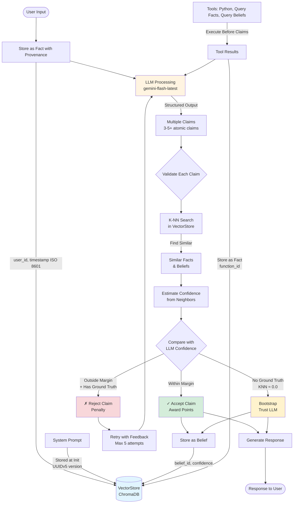
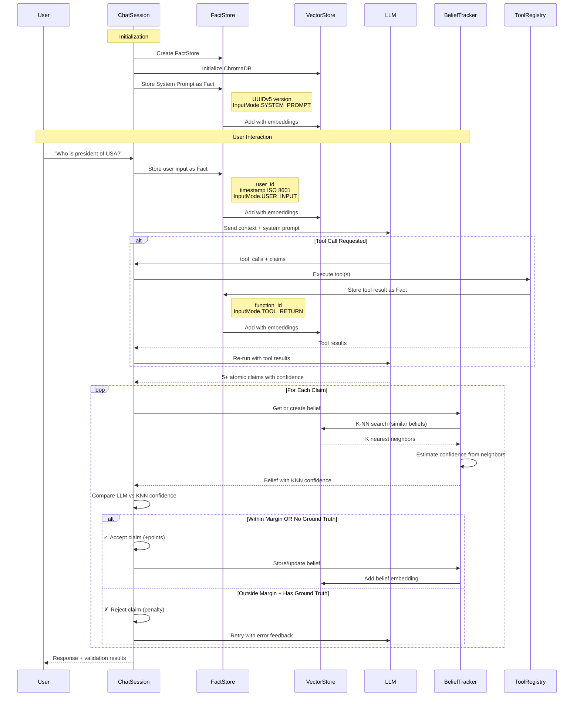
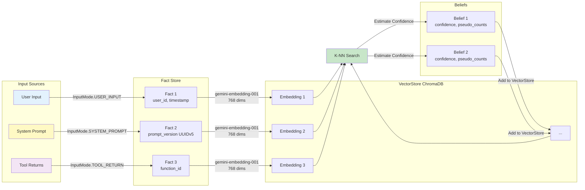

# Baye System Architecture

## Overview

Baye is an epistemic belief tracking system that simulates human memory and confidence through K-NN similarity search over a vectorstore of facts and beliefs.

## System Flow Diagram



## Detailed Component Flow



## Data Flow and Provenance



## Claim Validation Logic

```mermaid
flowchart TD
    Start([Claim from LLM]) --> GetBelief[Get/Create Belief]

    GetBelief --> KNN[K-NN Search<br/>Similar Facts + Beliefs]

    KNN --> Estimate[Estimate Confidence<br/>from K Neighbors]

    Estimate --> CheckGT{Has Ground Truth?}

    CheckGT -->|abs(actual) > 0.2<br/>OR certainty > 3.0| HasGT[Yes - Has Evidence]
    CheckGT -->|abs(actual) ≈ 0.0<br/>AND certainty ≤ 3.0| NoGT[No - No Similar Data]

    HasGT --> CheckMargin{Within Margin?}

    CheckMargin -->|abs(error) ≤ margin| Accept1[✓ Accept<br/>Award Points]
    CheckMargin -->|abs(error) > margin| Reject[✗ Reject<br/>Penalty + Retry]

    NoGT --> Bootstrap[Bootstrap Mode<br/>Trust LLM Confidence]

    Bootstrap --> Accept2[✓ Accept<br/>Initialize Belief]

    Accept1 --> Store[Store Belief<br/>Update Pseudo-Counts]
    Accept2 --> Store

    Store --> Vector[(Add to VectorStore<br/>For Future K-NN)]

    Reject --> Feedback[Add Error Feedback<br/>to Context]
    Feedback --> Retry{Retry < 5?}
    Retry -->|Yes| LLM[Re-run LLM]
    Retry -->|No| Fail[Max Retries Failed]

    LLM --> Start

    style Accept1 fill:#d4edda
    style Accept2 fill:#d4edda
    style Reject fill:#f8d7da
    style Bootstrap fill:#fff3cd
    style Vector fill:#e1f5ff
```

## Fact Provenance Structure

```mermaid
classDiagram
    class Fact {
        +string id (UUID)
        +int seq_id
        +string content
        +InputMode input_mode
        +string author_uuid
        +string source_context_id
        +int chunk_index
        +int total_chunks
        +string created_at (ISO 8601)
        +float confidence
        +dict metadata
    }

    class InputMode {
        <<enumeration>>
        USER_INPUT
        TOOL_RETURN
        SYSTEM_PROMPT
        DOCUMENT
        API_RESPONSE
        MANUAL
    }

    class UserInputFact {
        +author_uuid: user_id
        +metadata: {user_session, ...}
    }

    class ToolReturnFact {
        +author_uuid: function_id (tool.tool_uuid)
        +metadata: {tool_name, reasoning, ...}
    }

    class SystemPromptFact {
        +author_uuid: "system"
        +metadata: {prompt_version_uuid (UUIDv5), prompt_type, model}
    }

    Fact <|-- UserInputFact
    Fact <|-- ToolReturnFact
    Fact <|-- SystemPromptFact
    Fact --> InputMode

    note for SystemPromptFact "UUIDv5: Deterministic version ID\nbased on prompt content"
```

## Chunking for Large Facts

```mermaid
flowchart LR
    Input[Large Fact<br/>> 1500 tokens] --> Estimate[Estimate Tokens<br/>~4 chars = 1 token]

    Estimate --> Split[Split on Sentences<br/>. ! ?]

    Split --> Build{Build Chunks}

    Build --> Chunk1[Chunk 1<br/>~1500 tokens<br/>overlap: 100]
    Build --> Chunk2[Chunk 2<br/>~1500 tokens<br/>overlap: 100]
    Build --> Chunk3[Chunk 3<br/>~1500 tokens<br/>overlap: 100]

    Chunk1 --> Store1[Store as Fact<br/>chunk_index: 0<br/>total_chunks: 3]
    Chunk2 --> Store2[Store as Fact<br/>chunk_index: 1<br/>total_chunks: 3]
    Chunk3 --> Store3[Store as Fact<br/>chunk_index: 2<br/>total_chunks: 3]

    Store1 --> Embed1[Embed with<br/>gemini-embedding-001]
    Store2 --> Embed2[Embed with<br/>gemini-embedding-001]
    Store3 --> Embed3[Embed with<br/>gemini-embedding-001]

    Embed1 --> VectorStore[(ChromaDB)]
    Embed2 --> VectorStore
    Embed3 --> VectorStore

    note right of Chunk2
        100 token overlap
        ensures context
        continuity
    end note

    style VectorStore fill:#e1f5ff
```

## Key Design Principles

1. **Everything is a Fact**: All input to LLM (user input, system prompt, tool results) becomes a Fact with full provenance
2. **K-NN as Memory**: Confidence comes from similarity to existing facts/beliefs in vectorstore
3. **Bootstrap Trust**: When no similar data exists (KNN ≈ 0.0), trust LLM to initialize
4. **Granular Claims**: LLM produces 3-5+ atomic claims per response, each validated independently
5. **Gamification**: Points awarded for accurate confidence calibration
6. **Chunking**: Large facts automatically chunked with overlap for embedding model (2048 token limit)
7. **Provenance**: Complete tracking with timestamps (ISO 8601), user_id, function_id, prompt versions (UUIDv5)

## Technologies

- **LLM**: Google Gemini Flash Latest (gemini-flash-latest)
- **Embeddings**: Google Gemini Embedding 001 (768 dimensions)
- **Vector DB**: ChromaDB with persistent storage
- **Framework**: PydanticAI for structured outputs
- **Language**: Python 3.13+
